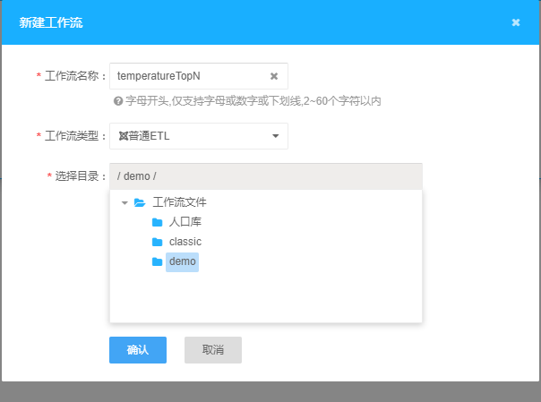
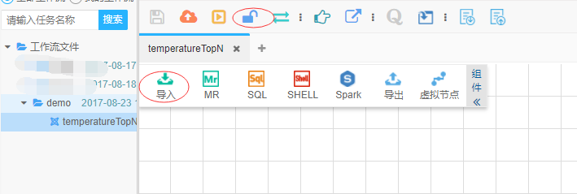
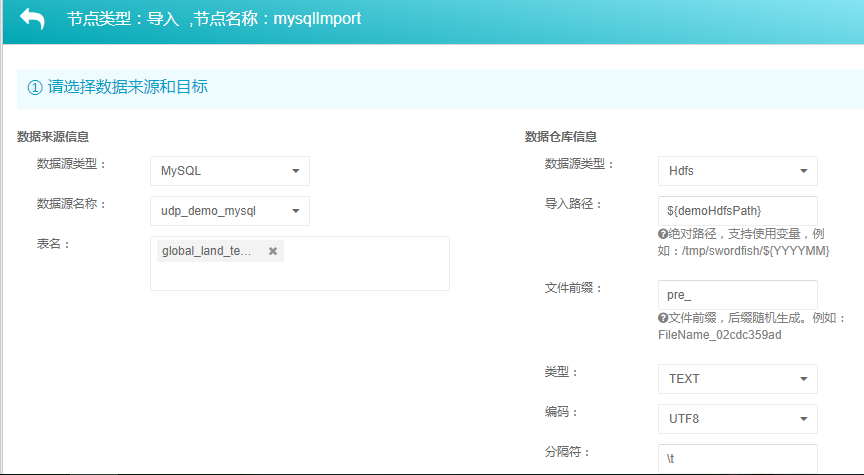
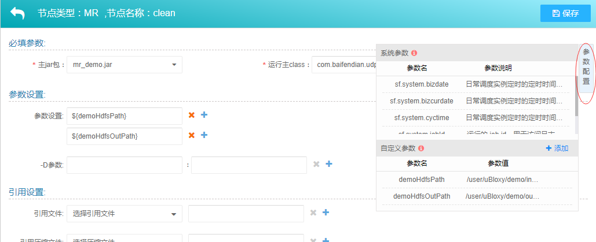
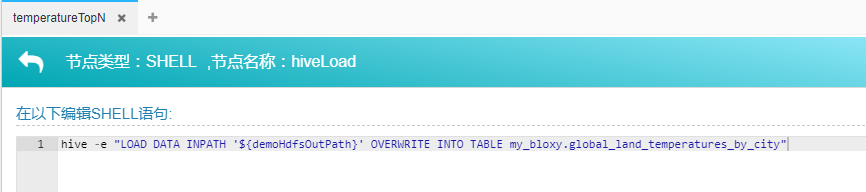
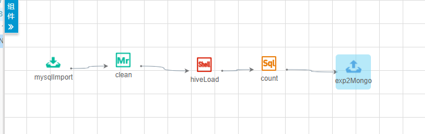
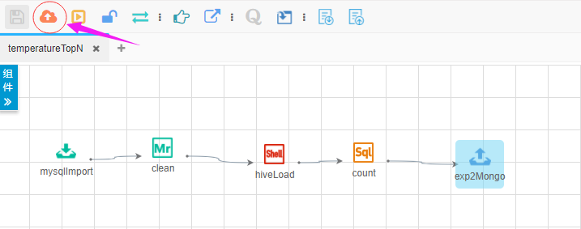
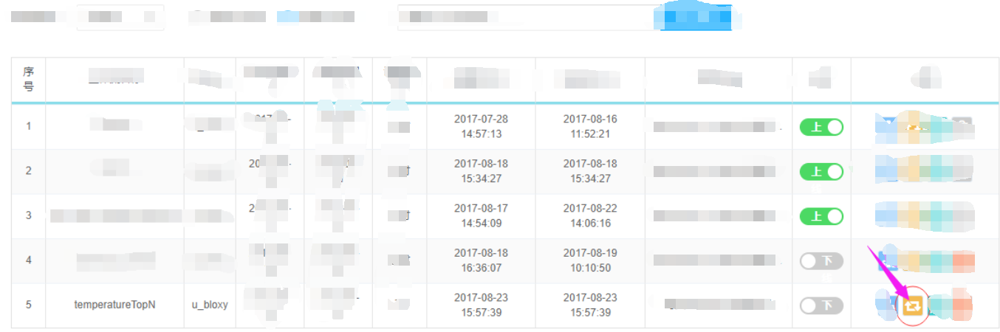
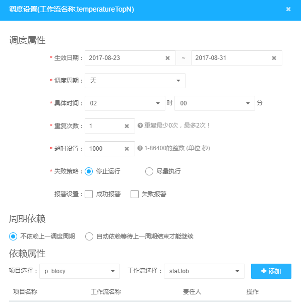

# 准备工作

1. 外部mysql数据库及表

执行如下SQL，创建库及授权

```SQL
CREATE DATABASE {db-name} DEFAULT CHARACTER SET utf8 DEFAULT COLLATE utf8_general_ci;
GRANT ALL PRIVILEGES ON {db-name}.* TO '{db-user}'@'%' IDENTIFIED BY '{password}';
GRANT ALL PRIVILEGES ON {db-name}.* TO '{db-user}'@'localhost' IDENTIFIED BY '{password}';
```

执行如下SQL，创建温度输入表

```SQL
CREATE TABLE `global_land_temperatures_by_city` (
  `dt` date NOT NULL,
  `average_temperature` double DEFAULT NULL,
  `average_temperature_uncertainty` double DEFAULT NULL,
  `city` text NOT NULL,
  `country` text NOT NULL,
  `latitude` text NOT NULL,
  `longitude` text NOT NULL,
  `year` int(11) NOT NULL
) ENGINE=InnoDB DEFAULT CHARSET=utf8
```

2. MongoDB数据库

3. MR计算jar资源

在项目根目录下，执行，如下命令

```
mvn clean package -pl examples -am
```

在{udp_demo_home}/examples/target目录下，会有examples-{version}.jar文件，该jar内包含了MR class.

# UDP配置

1. 添加数据源将mysql及mongoDB地址，按[数据源配置](../../docs/dataSource/dataSource.md)添加UDP数据源, 假设添加的数据源名称为 `udp_demo_mysql` 和 `udp_demo_mongo`

2. 将编译好的MR jar通过[资源管理](../../docs/resource/)上传到UDP平台内，假设资源名称为 `mr_jar`

3. 在 `数据开发 -> 工作流开发`内新建工作流. 如下:



4. 双击打开工作流，解锁后，添加导入节点




5. 双击导入节点，编辑详情



6. 添加MR节点，并编辑详情

运行主class为 `com.baifendian.udp.example.mr.App`

参数设置：

第一个参数为刚才导入节点的HDFS路径，第二个参数，为MR清洗输出路径.

由于此处的输入和输出路径，在其他节点也需要引用。所以，可以设置成自定义参数。如下：



7. 添加shell节点，编辑详情
   
通过shell节点，将MR清洗后的数据，导入到Hive表内。在shell节点内输入如下语句：

`hive -e "LOAD DATA INPATH '${demoHdfsOutPath}' OVERWRITE INTO TABLE my_bloxy.global_land_temperatures_by_city"`



8. 添加SQL节点，编辑详情

在sql节点内，添加如下参数

```
INSERT INTO top_n SELECT country, city, max(average_temperature) max_temp FROM my_bloxy.global_land_temperatures_by_city t GROUP BY country, city ORDER BY max_temp LIMIT 10
```

9. 添加导出节点

通过导出节点，将数据从UDP导出到mongoDB内


10. 运行依赖设置

根据节点运行先后顺序，进行依赖设置。如下：



11. 运行测试

节点参数及依赖设置完成后，可以运行工作流，进行测试.

运行结束后，可以在运维中心查看运行结果。如果发现运行失败，可以通过节点日志，查看失败原因，进行修改。日志查看如下：
                  
重复上述步骤，直到运行成功

12. 发布上线

运行测试成功后，便可以发布上线了。



13. 设置调度

工作流发布成功后，在`运维中心 -> 工作流设置` 找到工作流，点击调度设置，设置调度信息。





14. **上线**

调度设置成功后，便可以上线。这样，整个工作流，便会按照调度设置的，进行自动调度运行了


